# 1) What Causes What?

## Question \#1

The problem with just finding data from random cities on crime rates and
active police officers is that the data is too vague to truly prove
causation. As a data scientist just with crime rate data and police
force data, finding whether increased police presences causes lower
crime rates is impossible. Increased police presence is usually due to
high amounts of crime and being able to detect if high police presence
causes a lowering in crime, we would need more information than just
crime rates and police presence. We would need to be able to isolate
times when a police presence is larger than usual for other reasons than
crime, this would make proving causation much easier.

## Question \#2

Researchers from the University of Pennsylvania were able to isolate the
effect of police presence and crime. They did this by observing crime in
Washington D.C. when there was a “High Alert” for terrorism. A “High
Alert” in Washington D.C. forces a larger police presence throughout the
city when it occurs. As well this then isolates crime from the police
presence as the increased police presence in the city has nothing to do
with crime rates. Their result showed that on “High Alert” days crime
rates dropped.

## Question \#3

The second column of the table shows that ridership on the Metro during
“High Alerts” was not significantly affected. The researchers tested for
this because tourists and many victims of crime could be affected by the
“High Alert” and not go to work or be on the streets during a “High
Alert”. The researchers, though, found that ridership was not affected
during a “High Alert”, and therfore crime went down because of increased
police presence and not lack of victims.

## Question \#4

Table \#4 from the researchers’ paper aims specifically to separate out
different areas to see if there was a decrease in crime across all of
Washington D.C. or only in one specific area. The researchers decided to
isolate out the National Mall and compare it to the rest of Washington
D.C.. Their findings show that the National Mall has a significant
decrease in crime while the rest of Washington D.C. has a small decrease
in crime that is not statistically significant. From the podcast we know
that the main place that security is buffed during a terrorist threat is
at the National Mall. The large decrease in crime in the First District
(The National Mall) but no real significant decrease in crime elsewhere
almost tells us that specifically crime decreases where large police
presences are and not so much where there is not a large increase. You
can then use this information to tell you that placing more police
specific areas with high crime will decrease crime. Rather than
increasing your general level of policing across a city this data tells
you that increasing policing in a specific precinct can help lower
crime.

# 2) Tree modeling: dengue cases

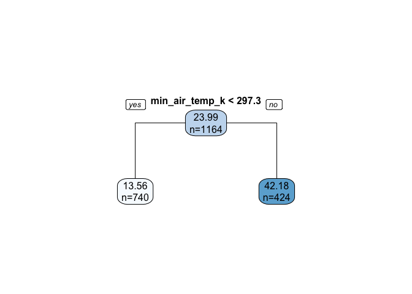

    ## [1] 42.37412

When growing out the tree model and pruning it back, a complexity
function that computes the complexity parameter within 1 standard
deviation of the minimum cross-validated error is called. Another
function is called which prunes the tree at this 1 standard deviation
complexity level. Visualizing this pruned tree above and calculating the
root mean squared error of about 42 dengue fever cases. We see the tree
is indeed simplified. Trees that perform well tend to be deeper, and
perhaps can allude to why this model performs the worst out of the three
utilized here, but is easily interpreted at this level.

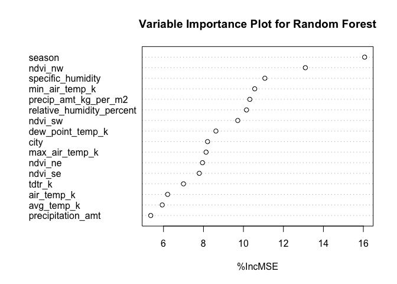

    ## [1] 28.36651

We can see above that seasonality, the “Normalized Difference Vegetation
Index” for the Northwest, and specific\_humidity are among the most
important variables the random forest considers. This random forest
model produces an RMSE of around 28 dengue fever cases. This plot is
calculated by comparing the performance accuracy of the model with an
original variable to the performance accuracy of a model that utilizes a
permuted variable.

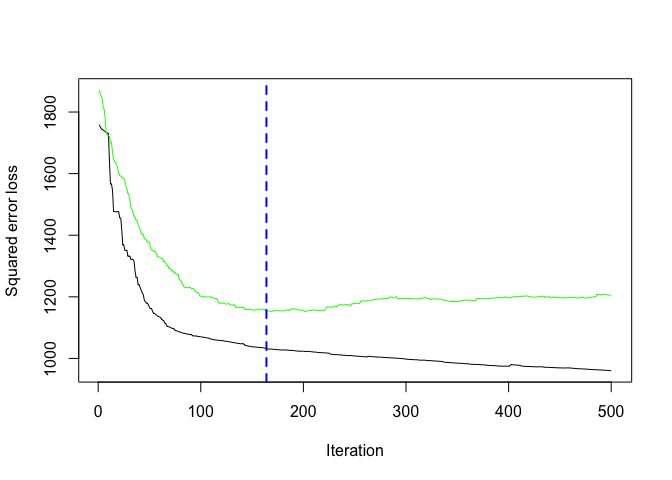

    ## [1] 164

    ## [1] 34.85783

Here, using a gradient boosted model, simple ‘base’ learners are
combined through iterations to produce a final estimate. The graph above
shows the performance metrics evolution as the gbm function combines
more and more of these simple ‘base’ learners. The black line is the
training Gaussian squared error loss (the distribution that is assumed
by gbm as per the squared error loss on the y-axis), and the green line
represents the testing Gaussian squared error loss. The tree amount
selected for prediction (using 164 trees in this instance) is indicated
by the blue, vertical, dashed line which indicates the point of where
the testing error on the cross-validated folds is minimized.

Overall, it is observed that the random forest model produces the lowest
RMSE time and time again. So, let’s incorporate some partial dependence
plots below. The three partial dependence plots below depict the
marginal effect that the specified feature has on predicted total dengue
fever cases.

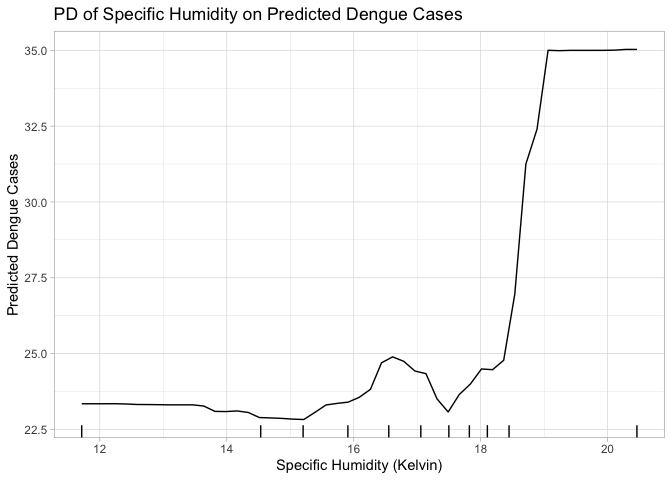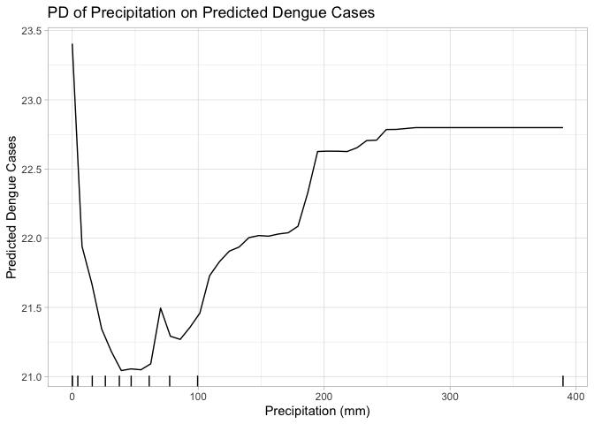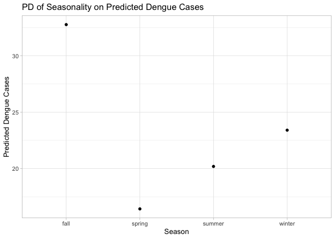

Above we observe marginal effects of each specified feature. When
passing the ‘rug’ argument in the pdp function, the distribution of data
can be observed which allows for a clearer interpretation of the regions
in the feature space, and actually helps mitigate over-interpretation.
As the first two graphs show, it is wise to tread lightly when
discussing the marginal effects of the variables when looking at the
regions that have rug marks which are sparse and not close together.
This primarily occurs on the outer portions of the graphs. Rugs are only
visible for the first two instances of the partial dependence plots. The
final partial dependence plot is categorical and used for it’s ranked
importance from the previous varImpPlot visual. For the predicted dengue
cases here, the Fall season shows greater effects than all other
seasons, with winter being a far-behind second.

# 3) Predictive model building: green certification

Let’s first start with a gradient-boosted tree model to see if we can
predict revenue accurately from our features:

For feature engineering, to create a revenue per square foot per year
variable, I divided leasing\_rate (originally a percentage) by 100 to
turn it into a proportion. I then multiplied that by Rent to create my
variable “revenue.”

    ## OOB generally underestimates the optimal number of iterations although predictive performance is reasonably competitive. Using cv_folds>1 when calling gbm usually results in improved predictive performance.

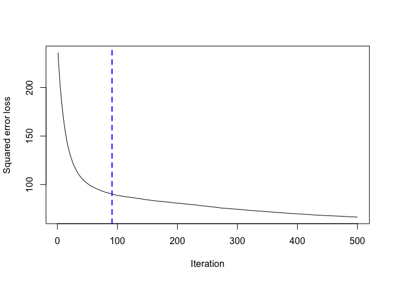

    ## [1] 91
    ## attr(,"smoother")
    ## Call:
    ## loess(formula = object$oobag.improve ~ x, enp.target = min(max(4, 
    ##     length(x)/10), 50))
    ## 
    ## Number of Observations: 500 
    ## Equivalent Number of Parameters: 39.85 
    ## Residual Standard Error: 0.1015

Here we see squared error as a function of number of trees. We will
continue to use 500 trees as it produces the lowest error and is not too
computationally intensive.

Let’s create some partial dependence plots with our gradient-boosted
tree. First we’ll look at size:
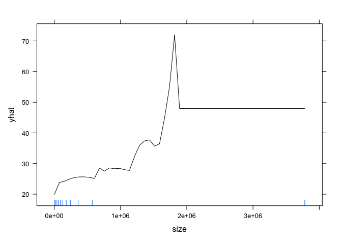

This partial dependence plot gives us a rough estimate of the
relationship between building size and revenue. We see that on average,
a building with a size of 2 million square feet brings in about $18 more
per square foot per year than a building with a size of 1 million square
feet. This is approximate because only 10 percent of the data is bigger
than 2 million square feet.

Let’s visualize the partial dependence on green\_rating:
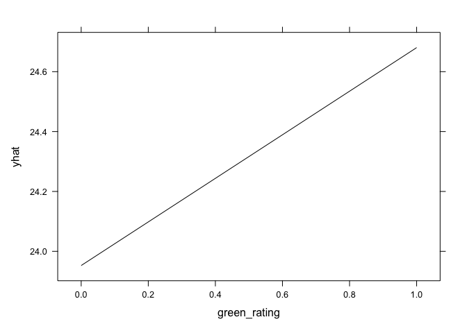
This partial dependence plot gives us a rough estimate of the
relationship between building green rating and revenue. We see that on
average, a building that is “green rated” brings in about $0.80 more per
square foot per year than a building with a size of 1 million square
feet. This is a significant increase that would create a lot of extra
revenue for a large building.

Let’s calculate our out-of-sample RMSE to see how accurate our
gradient-boosted tree model is:

    ## [1] 9.24014

This is pretty good, but let’s see if we can get lower error with a
random forest:

I fit a random forest to regress “revenue” on all the variables in the
training set except for those that I used to create the “revenue”
measure: “Rent” and “leasing\_rate.” I also used the collapsed
“green\_rating” variable in place of separate LEED and EnergyStar
variables.
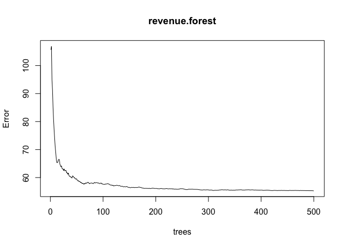
This plot shows out-of-bag MSE as a function of number of trees averaged
for the forest (randomForest defaults to 500.) We see that the error
bottoms out after about 100 trees.
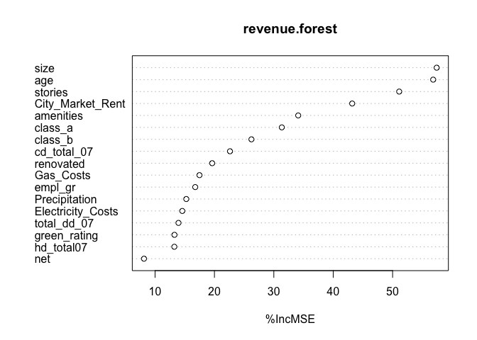
This plot shows the relative importance of our feature variables in the
random forest in determining revenue. The x-axis measures percent
increase in MSE if we were to omit a given variable on the y-axis. Here
we see that size, age, and stories are by far the most important for
fitting the forest, and green\_rating lands at the bottom of our plot as
the least important (only leads to a 10 percent increase in MSE if
omitted.)

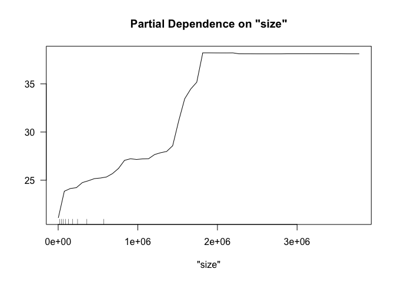
This partial dependence plot gives us a rough estimate of the
relationship between building size and revenue. We see that on average,
a building with a size of 2 million square feet brings in about $10 more
per square foot per year than a building with a size of 1 million square
feet.

Let’s visualize the partial dependence on green\_rating:
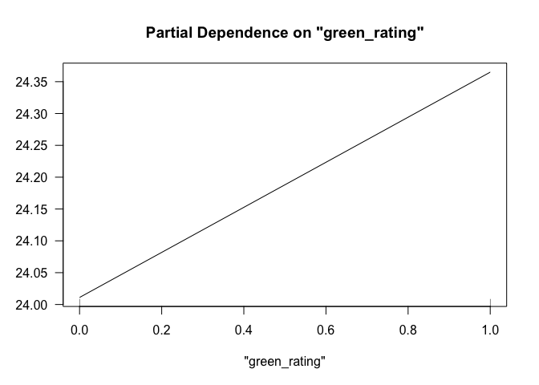
This partial dependence plot gives us a rough estimate of the
relationship between building green rating and revenue. We see that on
average, a building that is “green rated” brings in about $0.35 more per
square foot per year than a building with a size of 1 million square
feet. This is not a very large difference at the margin, but might make
a big difference in total revenue for a big building.

Let’s check the out-of-sample RMSE for our random forest:

    modelr::rmse(revenue.forest, revenue_test)

    ## [1] 7.32528

This is lower than the RMSE we got with gradient-boosted trees, so let’s
use the predictions of the random forest: the estimated partial effect
of green rating on revenue is $0.35 per square foot per year.

# 4) Predictive model building: California housing

    ## 
    ## Call:
    ## lm(formula = medianHouseValue ~ population + medianIncome + households + 
    ##     households * medianIncome + housingMedianAge + housingMedianAge * 
    ##     households, data = Xtilde_train)
    ## 
    ## Residuals:
    ##     Min      1Q  Median      3Q     Max 
    ## -522024  -48938  -12010   34478  877916 
    ## 
    ## Coefficients:
    ##                               Estimate Std. Error t value Pr(>|t|)    
    ## (Intercept)                  5024.2542  3221.6861   1.560    0.119    
    ## population                    -40.3417     1.2546 -32.155   <2e-16 ***
    ## medianIncome                40207.1691   499.6608  80.469   <2e-16 ***
    ## households                     61.7546     6.2395   9.897   <2e-16 ***
    ## housingMedianAge              749.9372    77.3603   9.694   <2e-16 ***
    ## medianIncome:households         7.6648     0.9107   8.416   <2e-16 ***
    ## households:housingMedianAge     2.8222     0.1370  20.600   <2e-16 ***
    ## ---
    ## Signif. codes:  0 '***' 0.001 '**' 0.01 '*' 0.05 '.' 0.1 ' ' 1
    ## 
    ## Residual standard error: 76050 on 16505 degrees of freedom
    ## Multiple R-squared:  0.5698, Adjusted R-squared:  0.5696 
    ## F-statistic:  3644 on 6 and 16505 DF,  p-value: < 2.2e-16

    ## [1] 76314.95

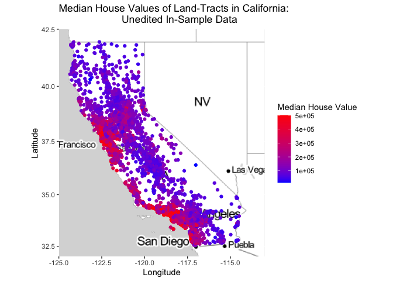

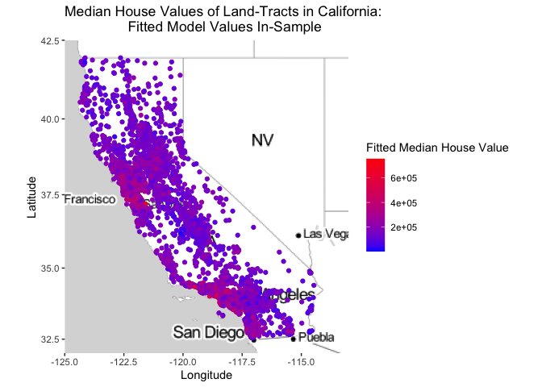

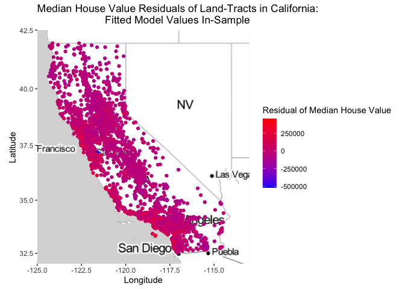

When modelling the data we wanted to find a way to best estimate the
median home value in a tract of land in California. We decided to
include population, median income for the tract, \# of households, and
median house age as our variables in the model. We also decided to
include some interaction variables in the equation as well, such as an
interaction between \# of households and median house age. I wanted to
include an interaction between these two variables because a small
sample of houses in a tract can greatly skew the median house age. As
well another interaction was included between median household income
and households for the same reason mentioned previously. The linear
model was relatively accurate generating a consistent R-squared value
above 0.52. Also when changing out relationships and dropping and adding
variables this model continuously had a lower out-of-sample RMSE value.
It should be noted though that our model had some trouble modelling a
few data points. When modelling, about 15 or so tracts mainly in cities
exhibited odd behavior of negative housing values. This was mainly due
to large populations of people, in low income neighborhoods, with
relatively young median house ages. These tracts mainly were in cities,
and were more than likely dense,low income neighborhoods that just
experienced new development. These few plot points were kept in the
analysis and linear modelling for the sake of accuracy, but when
graphing they were dropped. These points were dropped in the graphs
because they were such far outliers that they would skew the scale and
make the graphs unreadable. In order to actually make the graphs
informative and differentiable for a majority of the data in our sample,
we decided to drop these few outliers. As you can see, though, our model
does a good job mimicking the data. Our graph of fitted values and the
graph of the original data match well, and the graph of our residuals
shows a large grouping of data around zero.
